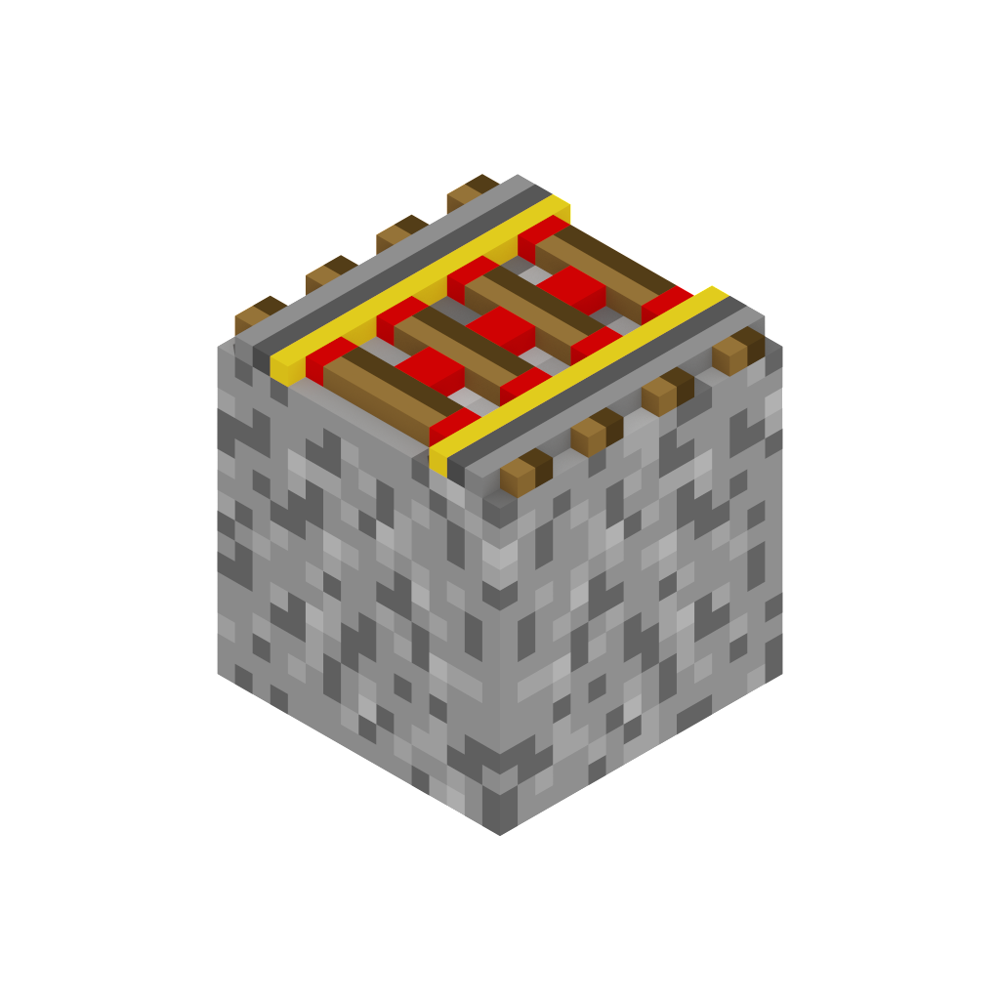

# High-speed Rail

Minecarts have been practically abandoned as a form of transportation over the years, since nearly every other type is faster (horses, boats, elytras, and even sprint-jumping with a block over your head). This datapack aims to solve that by providing a way to make your minecart tracks faster, witout affecting existing behavior for redstone contraptions and similar.

The new mechanic added is that if you put gravel underneath powered rails it will speed up your minecart a bunch, and with two layers of gravel even more. This gives players a incentive to build out rail infrastructure in their worlds that actually makes sense to use.

|   |   |   |
|---|---|---|
| normal minecarts |  | 8 m/s |
| 1 layer of gravel |  | 18 m/s |
| 2 layers of gravel |  | 28 m/s |
